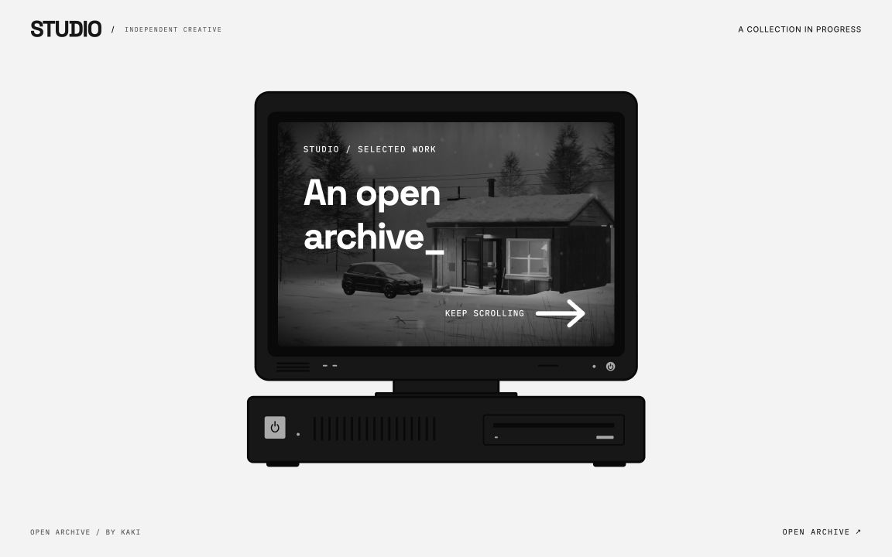
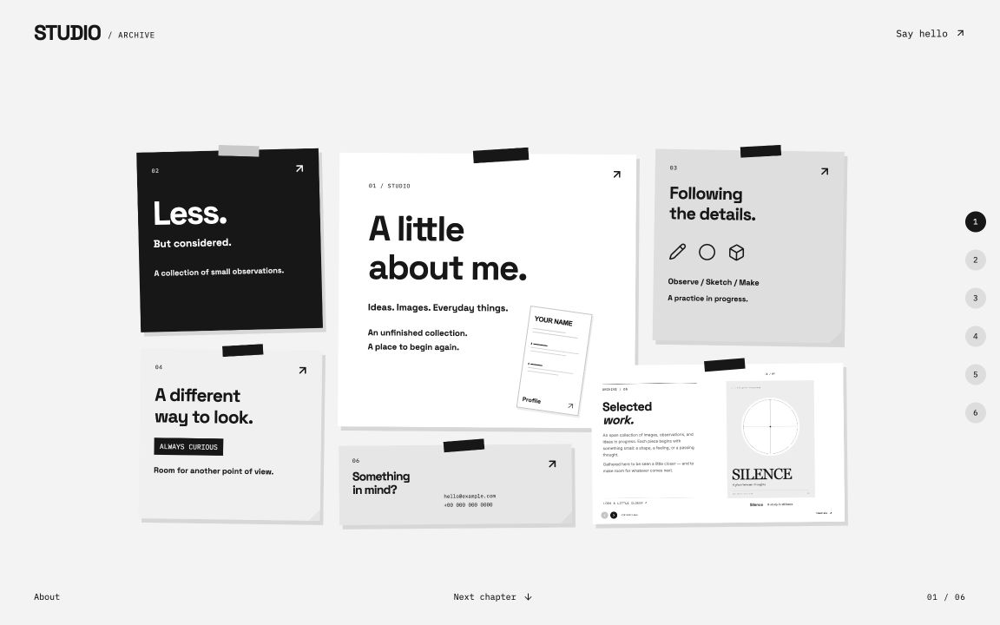
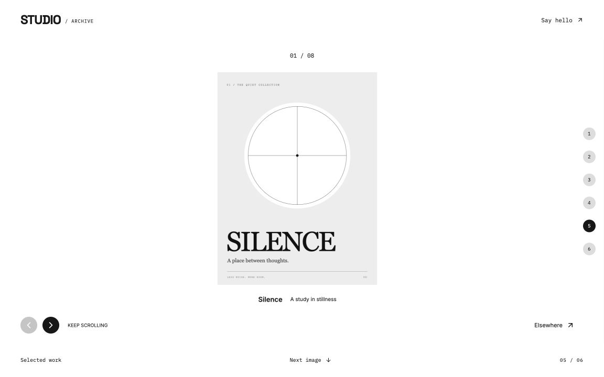
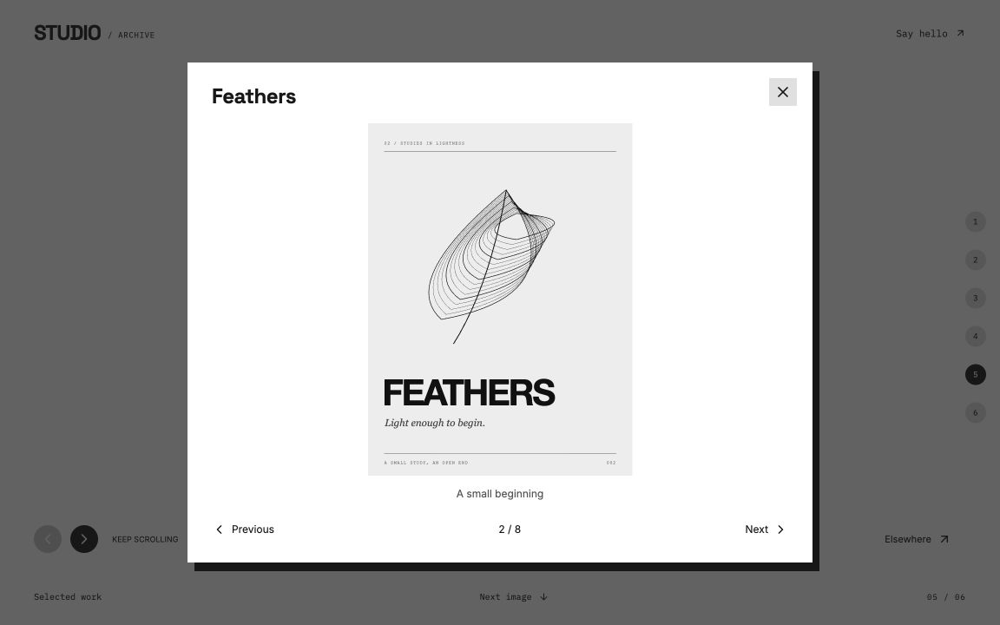

# An Open Archive

**一份可以慢慢展开的作品集。**

黑白、纸张、留白。从一台电脑开始，穿过便利贴展板，再把一张作品卡片放大成完整画廊。一个适合视觉设计、插画与创意实践的开源作品集模板，由 [KAKI](https://github.com/kakizzzzz) 制作。

**[打开演示 ↗](https://kakizzzzz.github.io/open-archive-portfolio/) · [MIT License](LICENSE)**

## 交互演示

https://github.com/user-attachments/assets/3344bb0f-10d2-4251-905b-c12c44fd2516

57 秒无声录屏 · 点击播放

## 四个画面，一段连续的浏览体验

| 01 / 电脑开场 | 02 / 纸条展板 |
| :--- | :--- |
|  |  |
| 03 / 作品画廊 | 04 / 点击查看 |
|  |  |

## 交互里有什么

- **滚动就是时间轴。** 场景由归一化进度 `t` 驱动，纯函数计算当前画面；向上滚动，动画沿原路返回。
- **从纸卡进入空间。** 05 作品卡片连续放大至全屏，左侧文字渐隐，右侧作品移向中央，画廊内容始终保留。
- **一条可以延长的画廊。** 滚动依次浏览作品，也可以用左右按钮切换。图片等高展示，页码随作品数量更新。
- **点击，再靠近一点。** 作品、文字卡片与个人资料都可以打开详情；关闭后继续原来的浏览位置。
- **屏幕里藏着颜色。** 视频默认静音循环播放，悬停时在指针周围柔和地露出彩色。主机左侧的大电源键可以关机，再按一次继续播放。

支持手机、平板与桌面布局，并提供键盘操作及减少动态效果的适配。

## 本地运行

需要 **Node.js 22 或更新版本**。Fork 或下载仓库，在项目目录运行：

```sh
npm ci
npm run dev
```

发布前检查构建，并预览生成的静态站点：

```sh
npm run build
npm run preview
```

`build` 已包含 TypeScript 检查，输出目录为 `dist/`。

## 换成你的内容

先修改资料与作品，再调整视觉样式。所有个人资料和联系方式均为示例。

| 文件 | 修改内容 |
| :--- | :--- |
| [`components/archive/content.ts`](components/archive/content.ts) | 品牌名称、个人介绍、联系方式、履历、文案、作品列表与视频路径 |
| [`public/assets/template/`](public/assets/template/) | 示例作品、视频与海报图片 |
| [`components/archive/archive.css`](components/archive/archive.css) | 配色、字体、纸张与界面样式 |
| [`components/archive/timeline.ts`](components/archive/timeline.ts) | 滚动时间轴、各模块停留与过渡 |
| [`main.tsx`](main.tsx) | 页面入口与字体导入 |

在 `portfolioWorks` 中增删作品，并填写图片的真实 `width`、`height`、标题及 `alt`。画廊会据此计算展示宽度、滚动距离与页码，无需固定为八件作品。

<details>
<summary><strong>配置电脑屏幕的视频</strong></summary>

在 `content.ts` 的 `introMedia` 中修改 `src` 和 `poster`。默认文件为：

```text
public/assets/template/intro-loop.mp4
public/assets/template/intro-loop-poster.jpg
```

可以直接替换为自己的彩色视频和对应静帧。更换文件名时，用 `import.meta.env.BASE_URL` 拼接路径，以适配 GitHub Pages 的仓库子路径。两个字段都设为 `null`，即可使用纯文字屏幕。

默认素材由 KAKI 原创，已裁剪并处理为约 40 秒的正反循环视频。模板只解码一份视频，通过 WebGL 绘制黑白与指针周围的彩色区域；替换素材不会自动裁剪或生成正反循环。

触屏设备或 WebGL 不可用时使用普通黑白视频；离开开场、切到后台或关机时暂停。开启系统「减少动态效果」时显示静态海报。浏览器限制自动播放时，海报也会作为备用画面。

</details>

## 发布到 GitHub Pages

1. 在你的仓库打开 **Settings → Pages**。
2. 将 **Build and deployment → Source** 设为 **GitHub Actions**。
3. 推送到 `main`，等待仓库内的 Pages 工作流完成。

工作流会自动构建并适配仓库路径。发布地址通常为 `https://你的用户名.github.io/你的仓库名/`。

## 许可与署名

原创代码、示例 SVG、视频及海报采用 **[MIT License](LICENSE)**。可以复刻、修改和再发布；分发副本或实质性部分时，请保留 **KAKI 的版权声明与完整许可文本**。欢迎保留网页中的作者署名，MIT 不额外要求可见网页署名。

<details>
<summary><strong>第三方依赖与诗歌来源</strong></summary>

字体和第三方依赖保留各自的许可，不随模板改为 MIT。完整声明见 [`THIRD_PARTY_NOTICES.md`](THIRD_PARTY_NOTICES.md) 与 [`licenses/`](licenses/)；字体原始许可随文件保存在 [`public/assets/template/fonts/`](public/assets/template/fonts/) 中。

示例纸条中的短诗节选保留作者与来源，不作为模板原创文字：

- [Walt Whitman — A Clear Midnight](https://poets.org/poem/clear-midnight)
- [Emily Dickinson — “Hope” is the thing with feathers](https://poets.org/poem/hope-thing-feathers-254)
- [William Blake — Auguries of Innocence](https://poets.org/poem/auguries-innocence)

这些来源将原诗标为公版作品；再次使用时，请保留来源，并核对所在地的版权状态。替换图片或视频时，请使用自己有权发布的素材。

</details>
